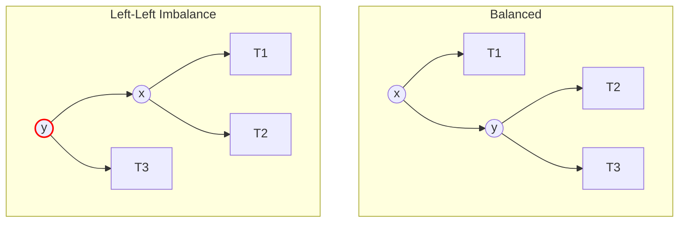
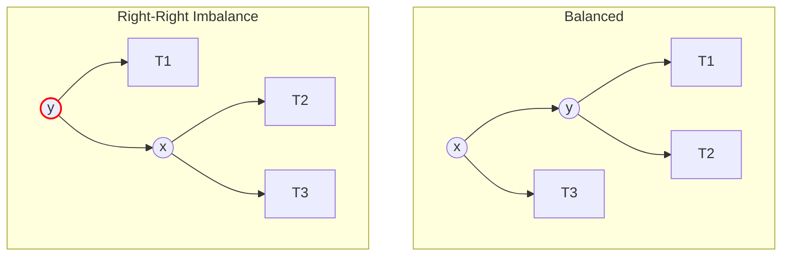
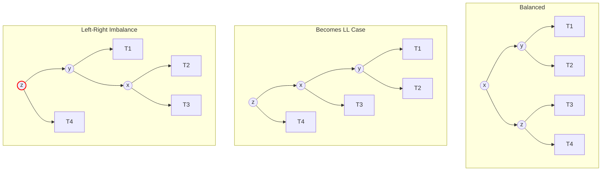
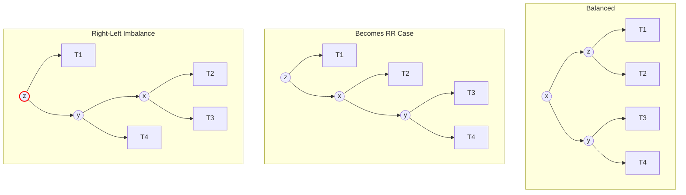

An **AVL Tree** (Adelson-Velsky and Landis) is a **self-balancing** [[Binary-Search Tree(s)]]. It was the first such data structure to be invented.

In a standard BST, inserting sorted data (e.g., 1, 2, 3, 4) leads to a "skewed" tree that behaves like a [[Linked List(s)]] with $O(n)$ search time. AVL trees solve this by automatically re-balancing themselves after every insertion or deletion to ensure the tree height remains logarithmic.

---
#### Vocab: Balance Factor
For **every** node in an AVL tree, the height difference between its left and right sub-trees (called the **Balance Factor**) must be at most 1.

$$BalanceFactor(N) = Height(LeftSubtree) - Height(RightSubtree)$$

- **Allowed Values:** $\{-1, 0, 1\}$
- **Unbalanced:** If the Balance Factor becomes $\le -2$ or $\ge 2$, the tree must be rebalanced via **Rotations**.

---
#### Time & Space Complexity Analysis
Because the tree is strictly balanced, the height is guaranteed to be $O(\log n)$.
[[Time Complexity]]

| Operation  | Time Complexity  |
| :--------- | :--------------- |
| **Search** | $\Theta(\log n)$ |
| **Insert** | $\Theta(\log n)$ |
| **Delete** | $\Theta(\log n)$ |

**Space Complexity:** $O(n)$

---
#### AVL vs. Red/Black Trees
Both are self-balancing BSTs, but they have different performance characteristics:
- **AVL Trees:** More strictly balanced. This makes **look-ups faster** but **insertion/deletion slower** (due to more frequent rotations).
    - *Use Case:* Read-heavy databases where data changes infrequently.
    - **[[Red/Black Trees]]:** Less strictly balanced. Faster insertion/deletion, slightly slower lookups.
    - *Use Case:* General-purpose maps (e.g., `std::map` in C++, `BTreeMap` in Rust, Linux Kernel schedulers).
---
#### Rotations
In an AVL Tree Re-balancing is triggered when a node's Balance Factor reaches $+2$ or $-2$. We perform rotations to strictly maintain logarithmic height.
##### 1. Single Right Rotation (LL Case)
- **Trigger:** Root `y` is **Left** heavy, and Left Child `x` is **Left** heavy.
- **Action:** Promote `x`. `y` moves down to the right. `x`'s right subtree (`T2`) is adopted by `y`.

##### 2. Single Left Rotation (RR Case)
- **Trigger:** Root `y` is **Right** heavy, and Right Child `x` is **Right** heavy.
- **Action:** Promote `x`. `y` moves down to the left. `x`'s left subtree (`T2`) is adopted by `y`.

##### 3. Left-Right Rotation (LR Case)
- **Trigger:** Root `z` is **Left** heavy, but Left Child `y` is **Right** heavy.
- **Action:**
    1.  **Left Rotate `y`:** Converts the structure to the LL case.
    2.  **Right Rotate `z`:** Fixes the resulting LL imbalance.

##### 4. Right-Left Rotation (RL Case)
- **Trigger:** Root `z` is **Right** heavy, but Right Child `y` is **Left** heavy.
- **Action:**
    1.  **Right Rotate `y`:** Converts the structure to the RR case.
    2.  **Left Rotate `z`:** Fixes the resulting RR imbalance.

---