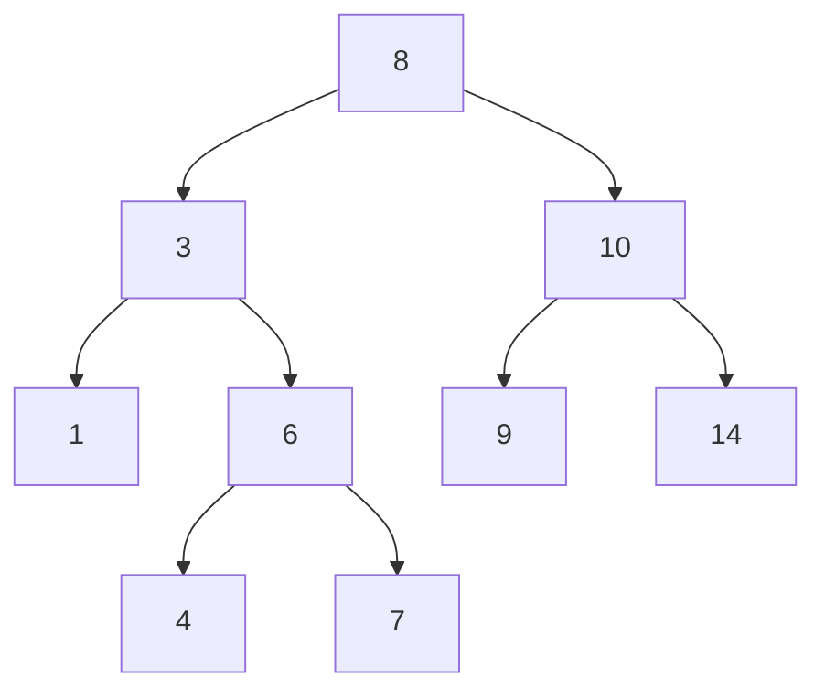

A **Binary Search Tree (BST)** is a specific type of [[Trees|Tree]] data structure where each node has at most two children, referred to as the *left child* and the *right child*. It maintains strict rules with the goal of making searching, insertion, and deletion efficient.

---
#### Properties
1.  The value of the **Left Child** is *less than* the value of the **Parent Node**.
2.  The value of the **Right Child** is *greater than* (or equal to, depending on implementation) the value of the **Parent Node**.
3.  Both the left and right sub-trees must also be Binary Search Trees.

In this example:
- **8** is the Root.
- Everything to the left of 8 (3, 1, 6, 4, 7) is smaller than 8.
- Everything to the right of 8 (10, 9, 14) is larger than 8.
---
#### Traversal
Traversing a BST in specific orders yields different results:
- **In-Order Traversal:** *Left, Root, Right* **|** Visits nodes in **sorted** (ascending) order.
- **Pre-Order Traversal:** *Root, Left, Right* **|** Useful for copying the tree.
- **Post-Order Traversal:** *Left, Right, Root* **|** Useful for deleting the tree.

```c
  void bst_inorder(BSTNode* root) {
	  if (root) {
		  bst_inorder(root->left);
		  printf("%d", root->key);
		  bst_inorder(root->right);
	  }
  }
  void bst_preorder(BSTNode* root) {
      if (root) {
		  printf("%d", root->key);
		  bst_preorder(root->left);
		  bst_preorder(root->right);
	  }
  }
  void bst_postorder(BSTNode* root) {
      if (root) {
		  bst_postorder(root->left);
		  bst_postorder(root->right);
		  printf("%d", root->key);
	  }
  }
```
---
#### Time Complexity
BSTs are designed to optimize search operations. By comparing the target value to the current node, you can eliminate half the remaining tree at each step (in a balanced tree), similar to [[Binary Search]].

| Operation  | Balanced Case | Unbalanced Case |
| :--------- | :------------ | :-------------- |
| **Search** | $O(log(n))$   | $O(n)$          |
| **Insert** | $O(log(n))$   | $O(n)$          |
| **Delete** | $O(log(n))$   | $O(n)$          |

*See [[Time Complexity]] for more details on Big-O notation.*

> [!WARNING] O(n)?
> If a BST becomes "unbalanced" (i.e., inserting numbers 1, 2, 3, 4, 5 in order), it essentially becomes a [[Linked List(s)|Linked List]]. 
> To prevent this, we use **Self-Balancing Trees**:
> - [[AVL Trees]]
> - [[Red/Black Trees]]
---
#### Operations
**Insertion**
```c
BSTNode* bst_insert(BSTNode* root, int key) {
	if (root == NULL) {
		BSTNode* newNode = (BSTNode*)malloc(sizeof(BSTNode));
		newNode->key = key;
		newNode->left = newNode->right = NULL;
		return newNode;
	}
	
	if (key < root->key)
		root->left = bst_insert(root->left, key);
	else if (key > root->key)
		root->right = bst_insert(root->right, key);
	return root;
}
```

**Deletion**
```c
BSTNode* bst_delete(BSTNode* root, int key) {
	if (root == NULL) return root;
	if (key < root->key)
		root->left = bst_delete(root->left, key);
	else if (key > root->key)
		root->right = bst_delete(root->right, key);
	else {
		// Node with only one child or no child
		if (root->left == NULL) {
			BSTNode* temp = root->right;
			free(root);
			return temp;
		} else if (root->right == NULL) {
			BSTNode* temp = root->left;
			free(root);
			return temp;
		}
		
		// Node with two children
		BSTNode* temp = bst_find_min(root->right);
		root->key = temp->key;
		root->right = bst_delete(root->right, temp->key);
		}
	return root;
}
```

**Search**
```c
int bst_search(BSTNode* root, int key) {
	if (root == NULL) return 0;
	if (root->key == key) return 1;
	if (key < root->key) return bst_search(root->left, key);
	return bst_search(root->right, key);
}
```

**Free (Post-Order Traverse)**
```c
void bst_free(BSTNode* root) {
	if (root == NULL) return;
	bst_free(root->left);
	bst_free(root->right);
	free(root);
}
```
---

