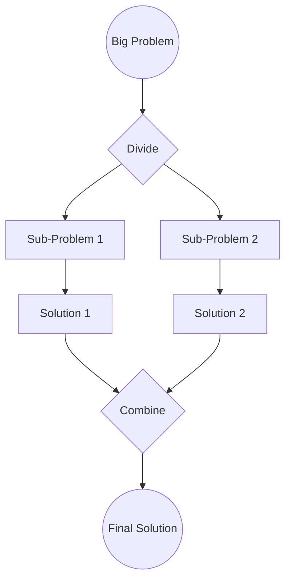

**Divide & Conquer** is a fundamental [[Data Structures & Algorithms|algorithm]] design paradigm based on multi-branched [[Recursion]]. A divide & conquer algorithm works by breaking a problem down into two or more sub-problems of the same or related type, until these become simple enough to be solved directly.

For Divide-&-Conquer algorithms, we calculate [[Time Complexity]] using the **[[Master Theorem]]**.

---
#### The Algorithm Design Paradigm
1.  **Divide:** Break the original problem into a set of sub-problems.
2.  **Conquer:** Solve every sub-problem individually (usually recursively).
3.  **Combine:** Merge the solutions of the sub-problems to generate the solution for the original problem.

---
#### Use Case
Divide-&-Conquer is the foundation of [[Parallel Computing]].
- **Independence:** Since sub-problems are disjoint (they don't share state), they can be solved on different [[Central Processing Unit(s) (CPU)]] cores or even different machines without locking.
- **[[MapReduce]]:** The famous Google algorithm is essentially distributed Divide-&-Conquer. "Map" divides the work, "Reduce" combines the results.
**Algorithmic Implementations:**
- [[Merge Sort]]
- [[Quick Sort]]
- [[Binary Search]]

---