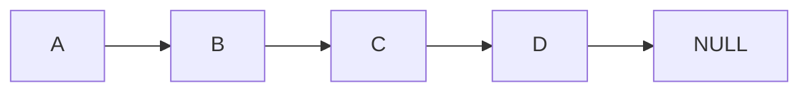
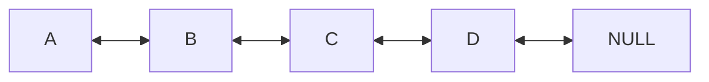
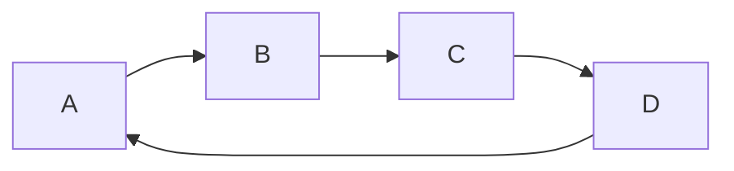

A Linked List is a very core linear data structure. Many other data structures can be thought of as an extension of the Linked List. A Linked List is simply a list of elements that are *not* saved sequentially in memory (unlike [[Basic Array(s)]]). Instead, elements are saved dynamically (randomly) on the *[[Heap(s)]]* using **[[Pointers and Memory|Pointers]]**.

---
#### Pros & Cons (Time & Space Complexity)
**Pros:**
Linked Lists are *dynamically allocated to the heap* (as opposed to [[Basic Array(s)]]). This avoids the main issue with Arrays, their fixed size. Linked Lists can be also very efficient for insertion or deletion making them well suited for basing other Data Structures from (i.e. [[Stack(s)]] , [[Queue(s)]]). Time Complexity for Inserting/deleting to head/tail is independent from the size of the list, or $θ(1)$.

**Cons:**
Linked Lists struggle when it comes to **Random Access** (unlike [[Basic Array(s)]]) and **Cache Locality** (due to non-sequential memory).

---
#### Types of Linked Lists

**Singly Linked List**
```c
struct Node {
char[32] data;
struct Node* next;
};
```

**Doubly Linked List**
```c
struct Node {
char[32] data;
struct Node* next;
struct Node* prev;
};
```

**Circular List**
A Circular Linked-List simply means instead of the last node pointing to NULL, it points back to the first element. Circular Linked Lists can be singly or doubly linked.


---
#### Operations on Linked Lists (in C)

**Create Node:**
```c
struct Node* createNode*(char *name) {
    struct Node *newNode = (struct Node*)malloc(sizeof(struct Node));
    if (!newNode) {
        return head;
    }
    strcpy(newNode->data, name);
    newNode->next = NULL;
    return newNode;
}
```

**Traversal (Print(), Free()):**
```c
void printList(struct Node *head){
	struct Node *p;
	p=head;
	if (!p) return;
	while(p){
		printf("%s\n",p->name);
		p=p->next;
	}
}

void freeList(struct Node *head) {
    struct Node *p;
    while (head) {
        p = head;
        head = head->next;
        free(p);
    }
}
```

**Append (Insert at Tail):**
```c
struct Node* appendNode(struct Node *head, char *name) {
    struct Node *newNode = createNode(name);
	
	//CASE: Empty List
    if (!head) {
        return newNode;
    }
	
	//CASE: Traverse to end of list
    struct Node *p = head;
    while (p->next) {
        p = p->next;
    }
    p->next = newNode;
    return head;
}
```
**Insert Alphabetically**
```c
struct Node* insertAB(struct Node *head, char *name){
    struct Node *p=head;
    struct Node *prev=NULL;

    struct Node *newNode = createNode(name);

    //CASE: Empty List
    if(!head){
        return newNode;
    }
    
	//CASE: Needs to become the new head node
    if(strcmp(p->name,name)>0){
        newNode->next=p;
        return newNode;
    }

	//CASE: Standard (Linear Search)
    while(p!=NULL && strcmp(p->name,name)<0){
        prev=p;
        p=p->next;
    }
    prev->next=newNode;
    newNode->next=p;  
    
  return head;
}
```
**Removal:**
```c
struct Node* removeNode(struct Node *head, char *target){
    struct Node *p=head;
    struct Node *prev=NULL;
    
    //CASE: target == head->name
    if(strcmp(p->data,target)==0){ 
        head=p->next;
        free(p);
        return head;
    }
    
	//CASE: Standard (Linear Search)
    while(p && strcmp(p->data,target)!=0){
        prev=p;
        p=p->next;
    }
	
	//CASE: Not Found
    if (!p){
        return head;
    }
    
	//CASE: Found
    prev->next=p->next; 
    free(p);
    return head;
}
```

---
