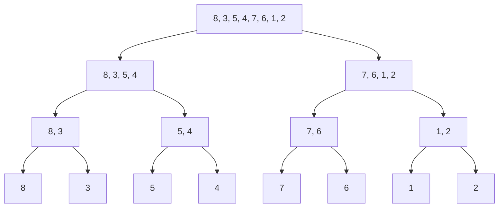
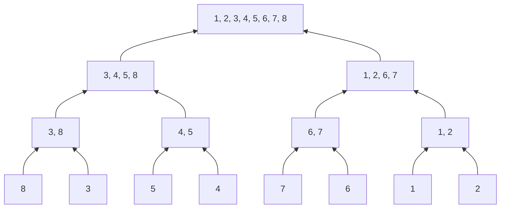

**Merge Sort** is a robust, efficient, and **stable** sorting algorithm that follows the [[Divide-&-Conquer]] paradigm. Unlike Quick Sort, it guarantees $O(n \log n)$ performance in the worst case.

---
#### The Algorithm
1.  **Divide:** [[Recursion|Recursively]] split the array into two halves until each sub-array contains a single element (base case).
*We don't actually create new arrays here (in an optimized C implementation); we just calculate indices.*


2.  **Conquer:** Repeatedly merge the sub-arrays to produce new sorted sub-arrays until only one remains.



---
#### Complexity Analysis

| Metric | Rating | Reason |
| :--- | :--- | :--- |
| **Time (Worst)** | $O(n \log n)$ | The tree height is $\log n$, and merging takes $O(n)$ work per level. |
| **Time (Best)** | $O(n \log n)$ | Always splits and merges fully (unlike Bubble/Insertion sort). |
| **Space** | $O(n)$ | **Critical Disadvantage.** Requires auxiliary memory for the temporary merge arrays. |
| **Stability** | **Yes** | Preserves the relative order of equal elements (crucial for multi-key sorting). |

---
##### C Implementation 
NOTE: `malloc` overhead is expensive. A production-grade Merge Sort often allocates the temporary buffer *once* at the start, rather than inside every recursive call.

```c
void merge (int a[], int l, int m, int r) {
	int i=l, j=m+1, k=0;
	int *temp=(int *) malloc(sizeof(int) * (r-l+1));
	while (i<=m && j<=r) {
		if (a[i] <= a[j]) {
			temp[k++] = a[i++];
		} else {
			temp[k++] = a[j++];
		}
	}
	while (i<=m) {
		temp[k++] = a[i++];
	}
	while (j<=r) {
		temp[k++] = a[j++];
	}
	for (int p=0; p<k; p++) {
		a[l+p] = temp[p];
	}
	free(temp);
}

void mergeSort(int a[], int l, int r) {
	if (l<r) {
	int m = l+(r-l)/2;
	mergeSort(a, l, m);
	mergeSort(a, m+1, r);
	merge(a, l, m, r);
	}
}
```

---
#### Linked Lists (The Use Case)
Merge Sort is the **preferred** algorithm for sorting Linked Lists.
- **Why?** Random access (needed for Quick Sort) is slow in lists. Merge Sort accesses data sequentially, which fits the Linked List structure perfectly.
- **Space Benefit:** For Linked Lists, Merge Sort can be implemented with **$O(1)$ auxiliary space** (just pointer manipulation), negating its main disadvantage.

---

