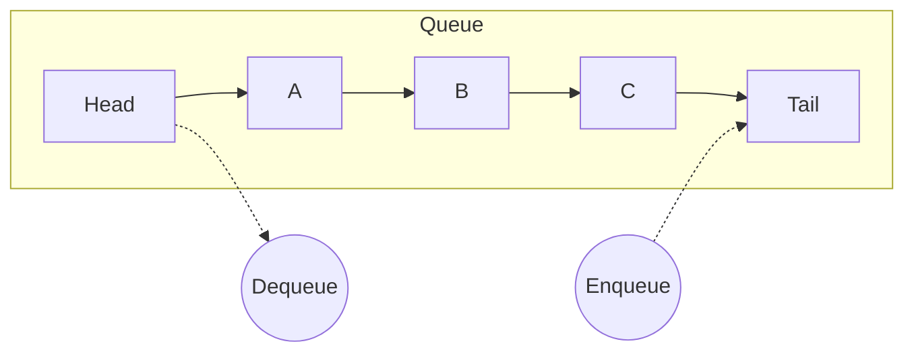

: **Queue** is a linear data structure that follows the **FIFO** (First-In, First-Out) principle. 

---
#### Core Operations
A standard queue requires efficient access to both ends.

1.  **Enqueue():** Add an element to the **Back** (Tail).
2.  **Dequeue():** Remove and return the element from the **Front** (Head).
3.  **Peek():** View the front element without removing it.

| Operation | Time Complexity | Notes                      |
| :-------- | :-------------- | :------------------------- |
| Enqueue   | $O(1)$          | Requires a `tail` pointer. |
| Dequeue   | $O(1)$          | Simple head removal.       |
|           |                 |                            |

---
#### Implementation

**1. Linked List Implementation**
*See [[Linked List(s)]] for struct definitions.*

Using a Singly Linked List is ideal for a dynamic queue because we avoid the fixed-size limit of arrays. To achieve $O(1)$ for both operations, we **must** maintain a pointer to the `tail` node.



```c
struct Queue {
    struct Node *head;
    struct Node *tail;
};

void enqueue(struct Queue *q, char *data) {
    struct Node *newNode = createNode(data); // See Linked List note
    
    if (!q->tail) { 
        // Empty Queue
        q->head = q->tail = newNode;
        return;
    }
    
    // Add to end and update tail pointer
    q->tail->next = newNode;
    q->tail = newNode;
}
```
---
#### Use Cases/Expansions

**1. [[Breadth-First Search (BFS)]]**
Queues are the engine behind BFS algorithms, used for:
- Shortest path finding (GPS).
- Social network connections (Friends of Friends). 
- Garbage Collection (Tracing live objects).

 **2. [[OS Scheduling & Buffering]]**
- **[[Process Scheduling]]:** The CPU "Ready Queue" holds processes waiting to run (Round Robin scheduling).
- **[[I/O Buffers]]:** When you type fast, keystrokes are added to a queue so the OS can process them in order without losing any.
- **[[Printer Spooling]]:** Documents wait in a FIFO queue.

**3. [[Message Queues (IPC)]]**
In multi-threaded or distributed systems, queues act as buffers between a "Producer" (creating work) and a "Consumer" (processing work), allowing them to operate asynchronously.

---

