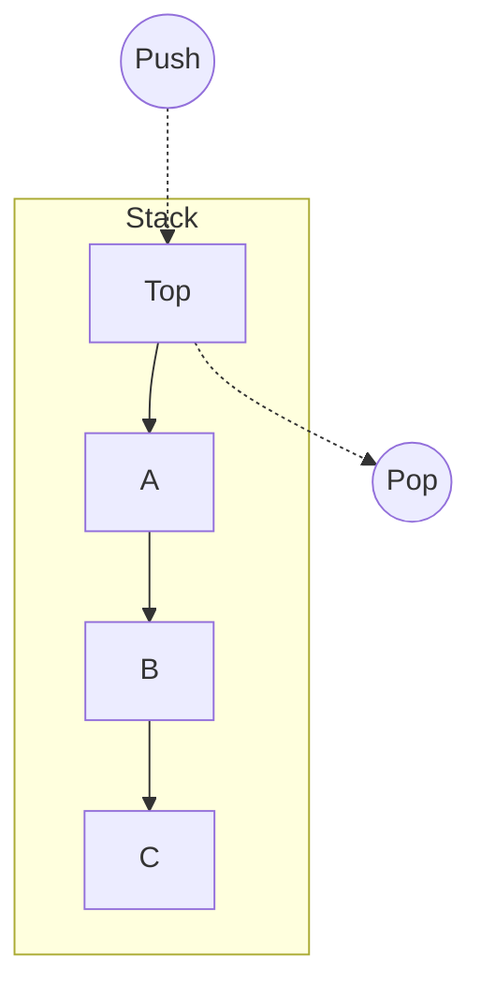

#algo #memory
A **Stack** is a linear data structure that follows the **LIFO** (Last-In, First-Out) principle. Think of it like a stack of paper: you can only add or remove the top sheet.

---
#### Core Operations
Both operations are extremely fast $O(1)$ because they only involve the "top" element.

1.  **Push():** Add an element to the top.
2.  **Pop():** Remove and return the top element.
3.  **Peek():** View the top element without removing it.

| Operation | Time Complexity | Space Complexity |
| :--- | :--- | :--- |
| Push | $O(1)$ | $O(1)$ |
| Pop | $O(1)$ | $O(1)$ |



---
#### The "Call Stack" or "The Stack"
In Programming, "The Stack" usually refers to the **Call Stack**, a specific region of [[RAM]] used to manage function calls.

- **Management:** Automatic (managed by the CPU/Compiler).
- **Mechanism:**
    - The CPU maintains a **Stack Pointer (SP)** register that points to the top of the stack.
    - When a function is called, a **Stack Frame** is "pushed". This contains:
        1.  Return Address.
        2.  Function Parameters.
        3.  Local Variables.
    - When the function returns, the pointer is moved back (popped), efficiently freeing all that memory instantly.

#### Stack Overflow
If you push too much data (e.g., infinite [[Recursion]] or allocating massive arrays on the stack), the Stack [[Pointer]] exceeds the allocated bound. This causes a segmentation fault or "Stack Overflow."

```c
// Example of Stack Overflow (Infinite Recursion)
void boom() {
    int array[1000]; // Allocates memory on the stack frame
    boom();          // Pushes a new frame... forever.
}
```

---
