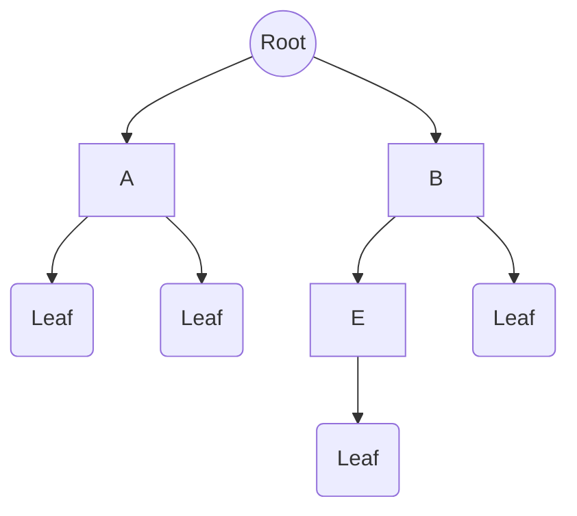

A **Tree** is a fundamental *hierarchical* data structure. Trees organize data much like a file system or an organizational chart. It consists of a collection of **nodes** connected by **edges**.

---
#### Vocabulary

- **Node:** An entity containing data (value) and pointers to its children.
- **Edge:** The link connecting two nodes.
- **Root:** The top-most node. It has no parent.
- **Parent:** A node that has an edge to a child node.
- **Child:** A node that has a parent node.
- **Leaf (External Node):** A node with no children.
- **Sibling:** Nodes that share the same parent.
- **Sub-tree:** A tree consisting of a node and its descendants.
#### Key Metrics (Crucial for Complexity Analysis)
- **Depth:** The number of edges from the **Root** to a specific node. (Root depth = 0).
- **Height:** The number of edges on the *longest path* from a specific node down to a **Leaf**. (Leaf height = 0).
- *Tree Height* = Height of the Root Node.
- **Degree:** The number of children a node has.
> [!info] Mathematical Foundation
> Because trees are defined recursively, their properties (such as the relationship between height and maximum nodes) are rigorously proven using **[[Mathematical Induction]]** 


Analysis:
- **Height of Tree:** 3 (Path: Root -> B -> E -> G).
- **Depth of Node E:** 2 (Path: Root -> B -> E).
---
#### Use Cases

1.  **Hierarchy:** Naturally represents hierarchical data ([[File System|File Systems]], [[HTML Document Object Model (DOM)]]).
2.  **Efficiency:** specific trees like [[Binary-Search Tree(s)]] or provide faster access/search ($O(\log n)$) than Linked Lists ($O(n)$) and faster insertion/deletion than Arrays.
3.  **Systems Applications:**
    - **File Systems:** Directory structures (folders within folders).
    - **Compilers:** [[Abstract Syntax Tree(s) (AST)]] to parse code.
    - **Databases:** [[Binary-Search Tree(s)]] or [[B-Trees]] for indexing large datasets.
    - **Networking:** Routing tables and[[Tries (Prefix Trees)]].---
#### Implementation

```c
struct Node {
    int data;
    struct TreeNode* left;  // Pointer to left child
    struct TreeNode* right; // Pointer to right child
};
```

---

#### Types of Trees
- **[[Binary-Search Tree(s)]]:** Ordered binary tree for efficient searching.
- **Self-Balancing Trees:** Guarantees $O(\log n)$ height.
    - [[AVL Trees]]
    - [[Red/Black Trees]]
- [[Heap(s)|Heaps]] Specialized tree for [[Priority Queue|Priority Queues]].
    - [[Min-Heap]] / [[Max-Heap]]
- [[B-Trees]] Multi-way search trees optimized for disk storage (Databases/File Systems).
- [[Tries (Prefix Trees)]] Optimized for string/text retrieval.

---

